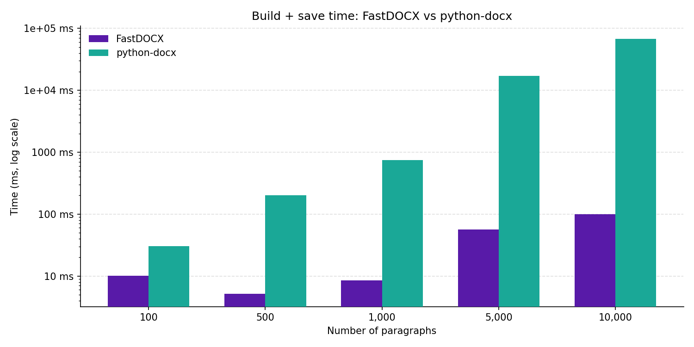
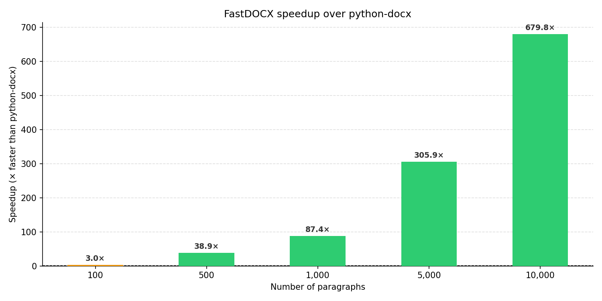
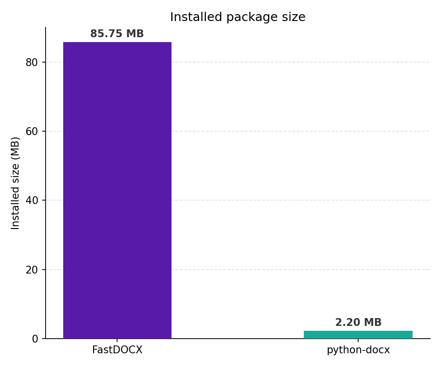

# NavyFox

<p align="center">
  
</p>

**NavyFox** is a Python library for any depth of DOCX file manipulation, writing and reading DOCX files simply like _python-docx_ or with Word-like fidelity powered by a
[C# Native AOT](https://learn.microsoft.com/dotnet/core/deploying/native-aot/)
shared library that wraps the
[DocumentFormat.OpenXml SDK v3.5.1](https://github.com/dotnet/Open-XML-SDK).

The Python API is clean, Pythonic, and inspired by both python-docx and docx-js — supporting
both flat shorthand for simple documents and fluent method chaining for complex formatting.

---

## Why NavyFox?

Most Python DOCX libraries wrap the OpenXML format at the XML level — parsing, modifying, and re-serialising XML trees in pure Python. This works well for simple documents, but runs into limits at scale and with more advanced formatting.

**Performance.** NavyFox delegates all document construction to a Native AOT-compiled C# binary using the official Open XML SDK. For large-scale automation — hundreds of documents, documents with large tables, or batch report generation — this is substantially faster than pure-Python alternatives because the heavy lifting happens in compiled native code rather than interpreted Python.




> Benchmarks measure wall-clock time to build and save a document with N paragraphs and an N/10-row table. Run `python scripts/benchmark.py && python scripts/generate_charts.py` to reproduce. For a more detailed workload breakdown (headings, tables, open + append), see [notebooks/benchmark.ipynb](notebooks/benchmark.ipynb).

**Package size.** The native AOT binary adds weight compared to python-docx. NavyFox is ~85 MB installed versus ~2 MB for python-docx. This is a deliberate tradeoff — the binary ships the .NET runtime and OpenXML SDK statically linked, with no separate runtime dependency required.



**First-class paragraph styles.** Defining and applying named paragraph styles (font, size, colour, spacing, alignment, based-on inheritance) is a first-class API in NavyFox rather than an afterthought requiring raw XML manipulation.

**Broader formatting support.** Features that require hand-crafting XML in other libraries — such as horizontal rules, custom table styles, and precise spacing control — are exposed as straightforward Python calls.

**The official SDK.** Because the native layer uses Microsoft's own DocumentFormat.OpenXml SDK, the output is structurally valid and well-formed by construction. You are not assembling XML strings or patching namespace tables by hand.

---

## Quickstart

```python
from navyfox import Document

with Document() as doc:
    doc.add_heading("Project Report", level=1)
    p = doc.add_paragraph()
    run = p.add_run("This report summarises Q1 findings.")
    run.bold = True

    table = doc.add_table(rows=3, cols=2)
    table[0, 0].text = "Region"
    table[0, 1].text = "Revenue"
    table[1, 0].text = "North"
    table[1, 1].text = "$1.2M"

    doc.save("report.docx")
```

---

## Examples

### Mixed-format paragraph with multiple runs

```python
from navyfox import Document

with Document() as doc:
    p = doc.add_paragraph(style="Normal")
    warning = p.add_run("Warning: ")
    warning.bold = True
    warning.font.name = "Arial"
    p.add_run("this value is ")
    emphasis = p.add_run("outside the expected range")
    emphasis.italic = True
    p.add_run(".")

    doc.save("output.docx")
```

### Custom paragraph styles

```python
from navyfox import Document
from navyfox.enums import Alignment
from navyfox.font import Font

with Document() as doc:
    # Register a named style once, reuse it across paragraphs
    doc.register_paragraph_style(
        "CallOut",
        based_on="Normal",
        bold=True,
        font_size=11,
        color="1F497D",
        alignment=Alignment.CENTER,
        space_before=120,
        space_after=120,
    )

    doc.add_paragraph("Key insight", style="CallOut")
    doc.add_paragraph("Another key insight", style="CallOut")

    doc.save("output.docx")
```

### Tables

```python
from navyfox import Document

headers = ["Name", "Role", "Department"]
rows = [
    ["Alice", "Engineer", "Platform"],
    ["Bob", "Designer", "Product"],
]

with Document() as doc:
    doc.add_heading("Team", level=2)

    # Pre-populate from a 2-D list
    doc.add_table(rows=3, cols=3, data=[headers] + rows)

    # Or build cell by cell
    table = doc.add_table(rows=2, cols=2)
    table[0, 0].text = "Q1"
    table[0, 1].text = "$1.2M"
    table[1, 0].text = "Q2"
    table[1, 1].text = "$1.8M"

    doc.save("output.docx")
```

### Open an existing document and append content

```python
from navyfox import Document

with Document("existing.docx") as doc:
    doc.add_heading("Appendix", level=1)
    p = doc.add_paragraph()
    p.add_run("Added programmatically.").italic = True
    doc.save("updated.docx")
```

---

## Installation

```bash
pip install navyfox
```

> **Note:** The wheel bundles pre-compiled native binaries for
> `linux-x64`, `linux-arm64`, `win-x64`, and `osx-arm64`.
> If you are on an unsupported platform you will need to build from source
> (see below).

---

## API reference

### `Document`

| Method | Description |
|---|---|
| `Document(source=None)` | Create a new document, or open an existing one from a path or file-like object. |
| `add_paragraph(text="", *, style=None)` | Append a paragraph; returns `Paragraph`. |
| `add_heading(text, level=1)` | Append a heading (level 1–6); returns `Paragraph`. |
| `add_table(rows, cols, *, data=None, strict=True)` | Append a table; returns `Table`. |
| `register_paragraph_style(style_id, ...)` | Register a named paragraph style for reuse. |
| `save(path)` | Write the document to *path*. |
| `close()` | Free the native handle explicitly. |

### `Paragraph`

```python
p = doc.add_paragraph(style="Normal")
run = p.add_run("Hello ")
run.bold = True
p.add_run("world")

p.text   # full text of all runs concatenated
p.runs   # list of Run objects
```

### `Run` / `Font`

```python
run = p.add_run("Hello")

# Convenience properties on Run
run.bold = True        # True / False / None (inherit)
run.italic = False
run.underline = True

# Detailed formatting via run.font
run.font.size = 12     # points
run.font.name = "Arial"
```

### `Table`

```python
table[row, col]              # returns Cell (zero-indexed)
table[row, col].text = "v"
```

### Enums

```python
from navyfox.enums import Alignment, HeadingLevel, ColorName

Alignment.LEFT | Alignment.CENTER | Alignment.RIGHT | Alignment.JUSTIFY
HeadingLevel.H1          # use with add_heading(level=HeadingLevel.H1)
ColorName.RED.color      # returns a Color instance
```

---

## Building from source

### Prerequisites

- .NET 9 SDK
- Python >= 3.11
- `clang` (Linux only, required by Native AOT)

### Build the native library

```bash
# Replace linux-x64 with your target RID
dotnet publish native/NavyFox.Native \
  -r linux-x64 -c Release \
  -p:PublishAot=true -p:NativeLib=Shared \
  -o navyfox/_libs/linux-x64/
```

### Install the Python package in editable mode

```bash
pip install -e ".[dev]"
```

### Run the test suite

```bash
# Unit tests (no native binary required)
pytest tests/unit/

# Integration tests (requires native binary)
pytest tests/integration/

# C# tests
dotnet test tests/native/NavyFox.Native.Tests/
```

---

## Project layout

```
navyfox/                  Python package
  _native/
    loader.py              Platform-aware lazy binary loader
    bindings.py            CFFI declarations
  _libs/                   Pre-compiled native binaries (populated by CI)
    linux-x64/
    linux-arm64/
    win-x64/
    osx-arm64/
native/NavyFox.Native/    C# Native AOT shared library
  NativeExports.cs         [UnmanagedCallersOnly] entry points
  DocumentBuilder.cs       OpenXML logic
  Marshalling/
    StructLayouts.cs       FFI-boundary structs
tests/
  unit/                    Python unit tests (mocked native layer)
  integration/             Round-trip tests (require native binary)
  native/                  C# xUnit tests
scripts/
  check_struct_layouts.py  CI struct annotation guard
.github/workflows/
  build-native.yml         Matrix AOT publish job
  ci.yml                   Lint / type-check / test pipeline
  release.yml              Wheel build & PyPI publish
```

---

## License

MIT
